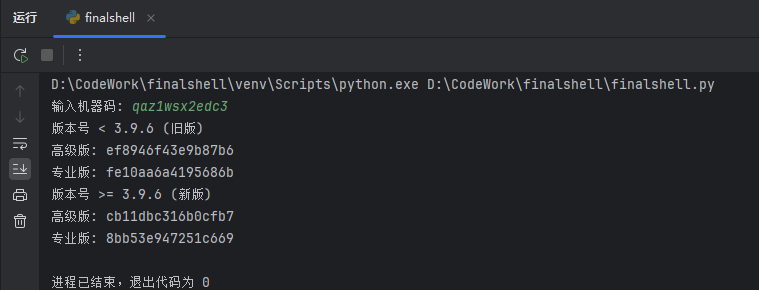

## 1. 概述
本手册旨在指导用户如何使用本软件进行哈希值的生成。软件支持生成MD5和Keccak-384两种哈希算法的哈希值。

## 2. 功能说明
- **MD5哈希**：一种广泛使用的哈希函数，可以生成32位的哈希值。
- **Keccak-384哈希**：基于`Keccak`算法的哈希函数，由内置的hashlib库中的sha3_384函数来生成Keccak-384散列值

## 3. 使用步骤

### 3.1 启动程序
运行程序后，程序会提示用户输入机器码。
```shell
    python3 finalshell.py
```

### 3.2 输入机器码
在提示“输入机器码: ”后，用户需要输入finalshell生成的机器码。
假设我们的机器码为：`qaz1wsx2edc3`


### 3.3 查看哈希结果
输入机器码后，程序将根据输入的机器码和预设的密钥，分别生成不同版本的哈希值，并显示在屏幕上。



## 4. 注意事项
- 请确保输入的机器码准确无误，错误的机器码将导致哈希值不正确。
- 本软件生成的哈希值仅供特定用途使用，不适用于其他安全需求。
- 如果在生成哈希值时遇到任何异常，请检查输入的机器码是否符合要求。

## 5. 技术支持
如果在使用过程中遇到任何问题或需要技术支持，请联系我。
